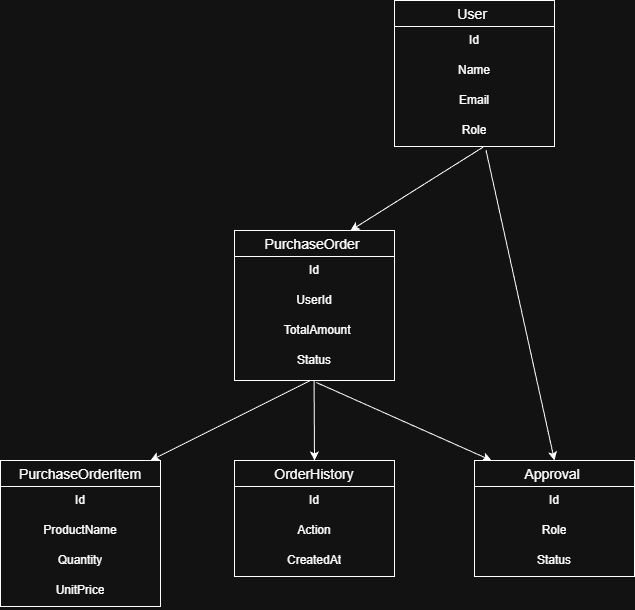
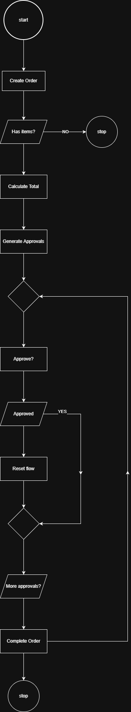
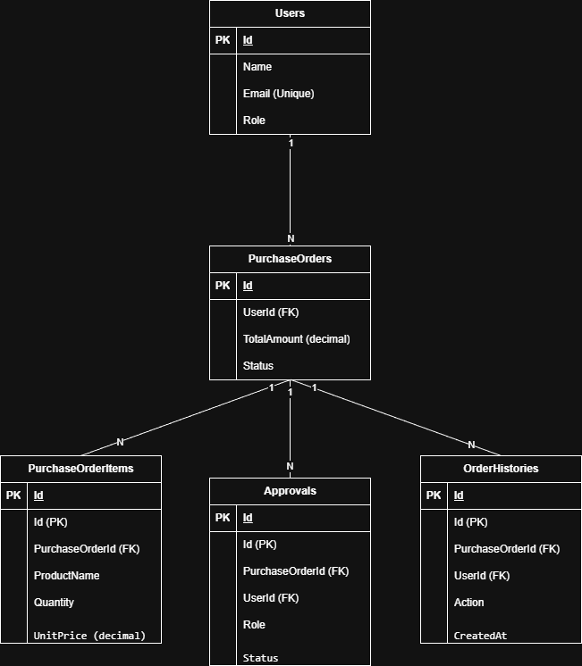

# 🧾 PurchaseOrderAPI

API REST desenvolvida em **C# (.NET 10)** para simular um processo de pedido de compras com fluxo de aprovação hierárquico, conforme especificação do desafio técnico.

---

## 🎯 Objetivo

Implementar uma API que represente o ciclo completo de um pedido de compra dentro de uma empresa, incluindo:

* Criação de pedidos
* Cálculo automático de valores
* Fluxo de aprovação por alçada
* Solicitação de revisão
* Cancelamento
* Histórico completo de ações

---

## ⚙️ Tecnologias Utilizadas

* .NET 10
* ASP.NET Core Web API
* Entity Framework Core
* SQL Server
* Swagger (Swashbuckle)

---

## 📁 Estrutura do Projeto

```
PurchaseOrderAPI/
│
├── Controllers/
│   └── PurchaseOrdersController.cs
│
├── Application/
│   ├── DTOs/
│   └── Services/
│
├── Domain/
│   ├── Entities/
│   └── Enums/
│
├── Infrastructure/
│   ├── Data/
│   └── Repositories/
│
├── Migrations/
│
├── postman/
│   └── PurchaseOrderAPI.postman_collection.json
│
├── docs/
│   └── diagrams/
│       ├── class-diagram.png
│       ├── activity-diagram.png
│       └── database-diagram.png
│
├── Program.cs
├── appsettings.json
├── appsettings.Development.json
└── README.md
```

---

## 📐 Diagramas

### 📦 Diagrama de Classes



---

### 🔄 Diagrama de Atividades



---

### 🗄️ Diagrama de Banco de Dados



---

## 📌 Regras de Negócio Implementadas

✔ Pedido deve ter pelo menos 1 item
✔ Cálculo automático do valor total

✔ Aprovação por alçada:

* Até R$100 → Supply
* R$101 até R$1000 → Supply + Manager
* Acima de R$1000 → Supply + Manager + Director

✔ Aprovação sequencial obrigatória
✔ Solicitação de revisão reinicia fluxo
✔ Histórico completo de ações
✔ Pedido só finaliza após todas aprovações
✔ Cancelamento disponível em qualquer etapa

---

## 🔧 Configuração do Banco de Dados

Arquivo:

```
appsettings.Development.json
```

Exemplo:

```json
{
  "ConnectionStrings": {
    "DefaultConnection": "Server=SEU_SERVIDOR\\INSTANCIA;Database=PurchaseDB;Trusted_Connection=True;TrustServerCertificate=True"
  }
}
```

### ⚠️ Altere conforme seu ambiente:

| Campo        | Descrição                                     |
| ------------ | --------------------------------------------- |
| SEU_SERVIDOR | Nome do servidor (ex: localhost, DESKTOP-123) |
| INSTANCIA    | Nome da instância (ex: SQLEXPRESS)            |
| PurchaseDB   | Nome do banco                                 |

---

## 🚀 Como Executar o Projeto

### 1. Restaurar dependências

```bash
dotnet restore
```

### 2. Criar migration (caso não exista)

```bash
dotnet ef migrations add InitialCreate
```

### 3. Atualizar banco de dados

```bash
dotnet ef database update
```

### 4. Rodar a aplicação

```bash
dotnet run
```

---

## 🔄 Reset do Banco de Dados (opcional)

```bash
dotnet ef database drop --force
dotnet ef migrations remove
dotnet ef migrations add InitialCreate
dotnet ef database update
```

---

## 🌐 Acessar API

Swagger:

```
http://localhost:5139/swagger
```

---

## 📬 Testes com Postman

Importe a collection:

```
postman/PurchaseOrderAPI.postman_collection.json
```

Fluxo recomendado:

1. Criar usuários
2. Criar pedido
3. Aprovar (Supply → Manager → Director)
4. Consultar histórico
5. Testar revisão/cancelamento

---

## 📊 Histórico do Pedido

O sistema registra automaticamente:

* Criação
* Aprovações
* Revisões
* Cancelamento
* Conclusão

Com:

* Usuário responsável
* Data/hora
* Ação executada

---

## ✅ Status do Projeto

✔ CRUD de pedidos
✔ Fluxo de aprovação completo
✔ Revisão
✔ Cancelamento
✔ Histórico rastreável
✔ Collection Postman

---

## 👨‍💻 Autor

Desenvolvido como parte de desafio técnico back-end.

---
